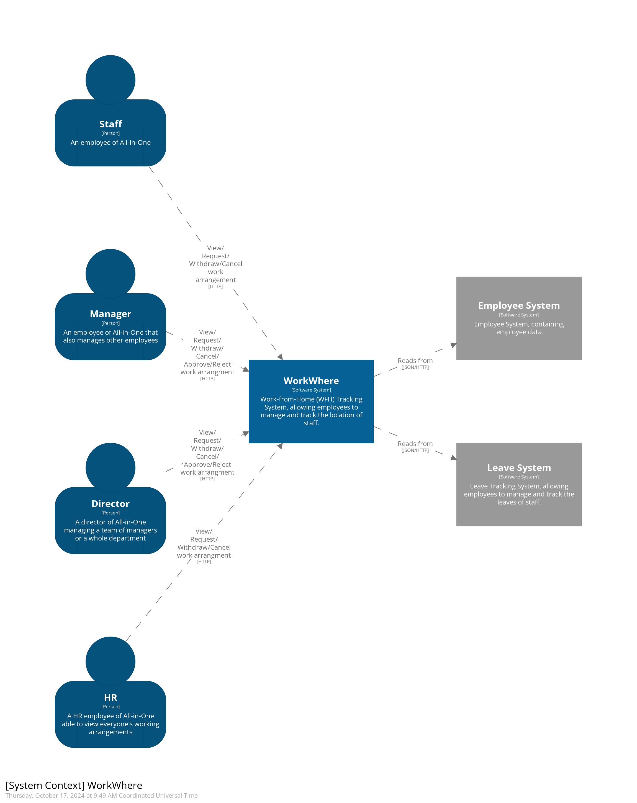
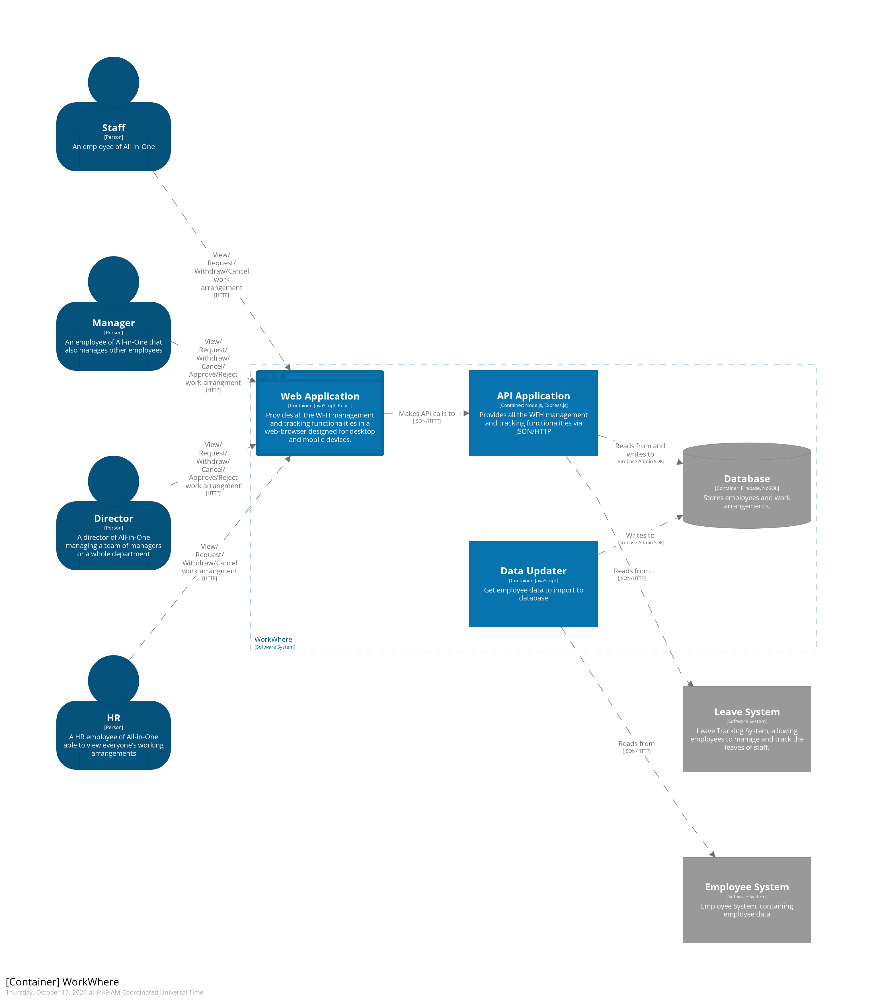
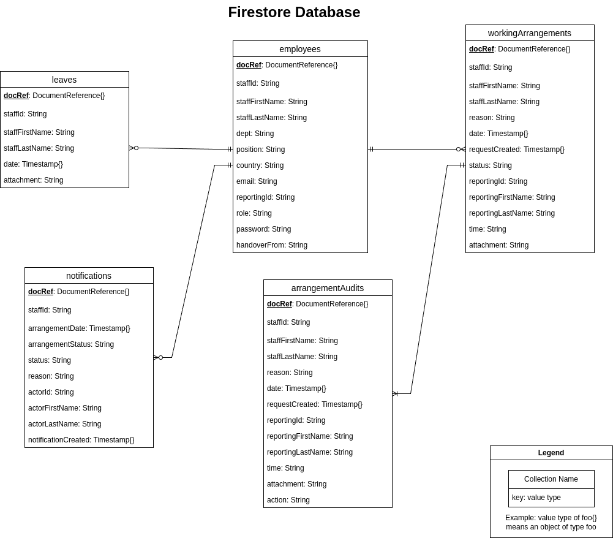
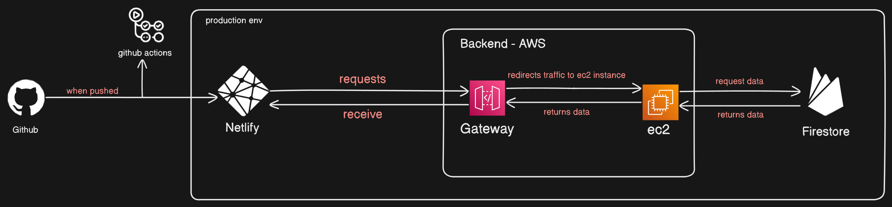

# WorkWhere
A Work-from-Home tracking system for the company All-in-One. It comprises of a web application hosted on [AWS](https://aws.amazon.com/) and database hosted on [Firebase](https://firebase.google.com/).

## Models





## Setup
### Prerequisites:
- [Node.js](https://nodejs.org/en/) v20.15.0 (_or above_)
- A [Firebase](https://firebase.google.com/) project set up with the secrets stored in `backend/workwhere_firebase_env.json`
- You may need to do indexing for the employees, workingArrangements and notifications collections, as well as their test counterparts
- A `.env` file in the `frontend` directory, default values are as shown:
    ```
    VITE_BACKEND_HOST=http://localhost
    VITE_BACKEND_PORT=3000
    ```
### Running the app:
1. Install dependencies in the `backend` directory.

    `~/workwhere/backend$ npm install`

1. Run the backend server. It will be on http://localhost:3000 by default.

    `~/workwhere/backend$ npm run start`

1. Install dependencies in the `frontend` directory.

    `~/workwhere/frontend$ npm install`

1. Build the frontend React app.

    `~/workwhere/frontend$ npm run build`

1. Run the frontend server. It will be on http://localhost:4173 by default.

    `~/workwhere/frontend$ npm run preview`

## Testing
We use [Jest](https://jestjs.io/) testing for our unit and integration tests. Note that you need run the commands in the `backend` directory and have the `workwhere_firebase_env.json` file in it to successfully run the tests.

### Test scripts:
- All tests with coverage:

    `~/workwhere/backend$ npm run test`

- Integration tests only:

    `~/workwhere/backend$ npm run it`

- Unit tests only:

    `~/workwhere/backend$ npm run ut`
